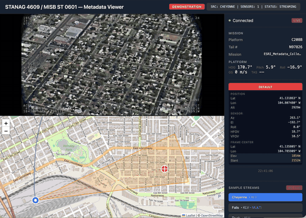
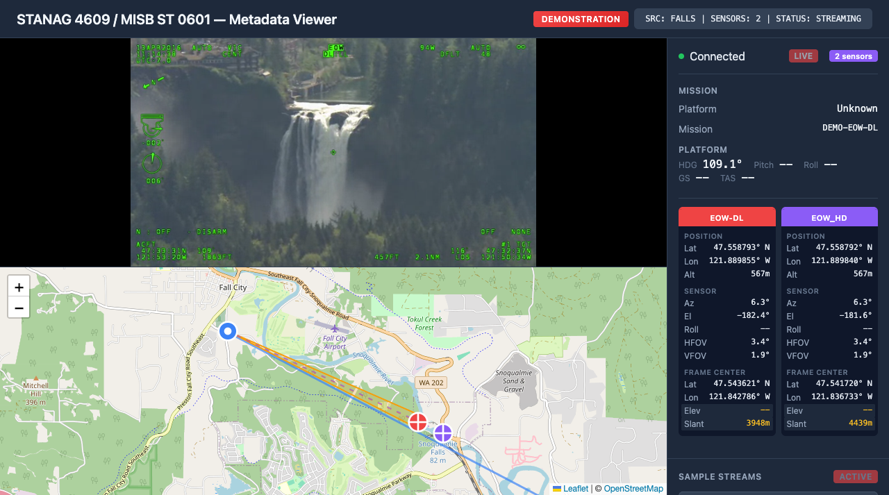
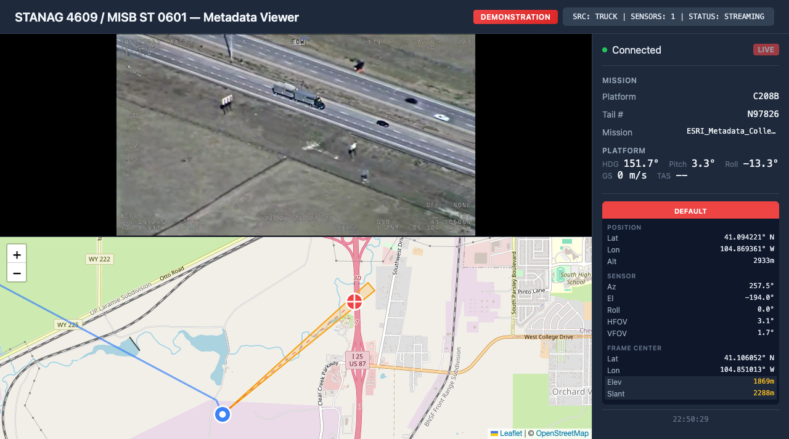

# STANAG 4609 / MISB ST 0601 — Metadata Viewer

Real-time STANAG 4609 MPEG-TS stream decoder with KLV metadata extraction and visualization.



## Features

### Stream Processing
- **UDP/RTP Real-Time Ingest** — Configurable port listening for live MPEG-TS streams
- **STANAG 4609 Demuxing** — Full MPEG-TS container parsing with PID detection
- **Multi-Codec Support** — H.264, H.265/HEVC, MPEG-2 with automatic detection
- **Hardware Transcoding** — FFmpeg-based pipeline with GPU acceleration support

### Metadata Extraction
- **MISB ST 0601 KLV Parsing** — Complete UAS Datalink Local Set decoding
- **Multi-Sensor Detection** — Automatic identification and tracking of multiple sensors
- **Real-Time Updates** — 60fps synchronized metadata display
- **Auto Stream Lock** — Automatic source detection with recovery on stream changes

### Video Delivery
- **WebRTC Ultra-Low Latency** — Sub-200ms glass-to-glass latency
- **VP8/VP9 Transcoding** — Browser-compatible real-time encoding
- **TURN Server Support** — NAT traversal for remote deployments

### Visualization
- **Interactive Map** — Leaflet-based display with OpenStreetMap tiles
- **Platform Tracking** — Real-time aircraft/drone position with flight path history
- **FOV Visualization** — Sensor field-of-view cone projection
- **Target Markers** — Frame center and corner point display
- **Multi-Sensor Overlay** — Simultaneous display of multiple sensor targets

## Screenshots

| Falls (Dual Sensor) | Truck (Tracking) |
|---------------------|------------------|
|  |  |

## Architecture

```
┌─────────────────────────────────────────────────────────────────────┐
│                         UDP INPUT (Port 5000+)                      │
│                        STANAG 4609 MPEG-TS                          │
└─────────────────────────────────┬───────────────────────────────────┘
                                  │
                                  ▼
┌─────────────────────────────────────────────────────────────────────┐
│                           BACKEND (Node.js)                         │
│  ┌─────────────────┐  ┌─────────────────┐  ┌─────────────────────┐  │
│  │  MPEG-TS Demux  │  │   KLV Parser    │  │  FFmpeg Pipeline    │  │
│  │   PID Detection │  │  MISB ST 0601   │  │  H.264 → VP8/VP9    │  │
│  └────────┬────────┘  └────────┬────────┘  └──────────┬──────────┘  │
│           │                    │                      │             │
│           ▼                    ▼                      ▼             │
│  ┌─────────────────────────────────────────────────────────────┐    │
│  │                    WebSocket Server                          │    │
│  │         KLV Data + WebRTC Signaling + Stream Control         │    │
│  └─────────────────────────────────────────────────────────────┘    │
└─────────────────────────────────┬───────────────────────────────────┘
                                  │
                                  ▼
┌─────────────────────────────────────────────────────────────────────┐
│                          FRONTEND (React)                           │
│  ┌─────────────┐  ┌─────────────┐  ┌─────────────┐  ┌───────────┐  │
│  │ Video Player│  │  Leaflet    │  │  Info Panel │  │  Sensor   │  │
│  │   WebRTC    │  │    Map      │  │   KLV Data  │  │  Selector │  │
│  └─────────────┘  └─────────────┘  └─────────────┘  └───────────┘  │
└─────────────────────────────────────────────────────────────────────┘
```

## Tech Stack

| Component | Technology |
|-----------|------------|
| Backend | Node.js, FFmpeg, GStreamer |
| Frontend | React, Vite, Leaflet |
| Video | WebRTC, VP8/VP9 |
| Protocol | STANAG 4609, MISB ST 0601, KLV |

## KLV Tags Supported

| Tag | Description |
|-----|-------------|
| 2 | Precision Time Stamp |
| 5 | Platform Heading |
| 6-7 | Platform Pitch/Roll |
| 13-15 | Sensor Latitude/Longitude/Altitude |
| 16-17 | Horizontal/Vertical FOV |
| 18-20 | Sensor Relative Azimuth/Elevation/Roll |
| 21 | Slant Range |
| 23-25 | Frame Center Lat/Lon/Elevation |
| 26-33 | Corner Offset Points |

## Quick Start

### Prerequisites
- Node.js 18+
- FFmpeg with libvpx support
- (Optional) coturn for TURN server

### Installation

```bash
# Clone repository
git clone https://github.com/your-username/klv-display.git
cd klv-display

# Install dependencies
cd backend && npm install
cd ../frontend && npm install

# Start backend
cd backend && npm start

# Start frontend (dev)
cd frontend && npm run dev
```

### Live Mode

```bash
# Send STANAG 4609 stream to the viewer
ffmpeg -re -i your-stanag-file.ts -c copy -f mpegts udp://localhost:5000
```

## Demo

**Live Demo:** http://141.253.115.214

Pre-recorded STANAG 4609 sample streams with synchronized KLV metadata.

## Project Structure

```
klv-display/
├── backend/
│   ├── src/
│   │   ├── parsers/        # KLV & MPEG-TS parsing
│   │   ├── framebuffer/    # Video transcoding pipeline
│   │   └── server.js       # WebSocket & HTTP server
│   └── package.json
├── frontend/
│   ├── src/
│   │   ├── components/     # React components
│   │   │   ├── Map.jsx     # Leaflet map with markers
│   │   │   ├── InfoPanel.jsx
│   │   │   └── VideoPlayer.jsx
│   │   ├── hooks/          # WebSocket & WebRTC hooks
│   │   └── App.jsx
│   └── package.json
├── demo-server/            # Lightweight demo server
├── demo-assets/            # Pre-encoded sample streams
└── docs/                   # Screenshots & documentation
```

## Standards Compliance

- **STANAG 4609** — NATO Digital Motion Imagery Standard
- **MISB ST 0601** — UAS Datalink Local Set
- **MISB ST 0102** — Security Metadata Local Set
- **SMPTE 336M** — KLV Data Encoding Protocol

## License

MIT
